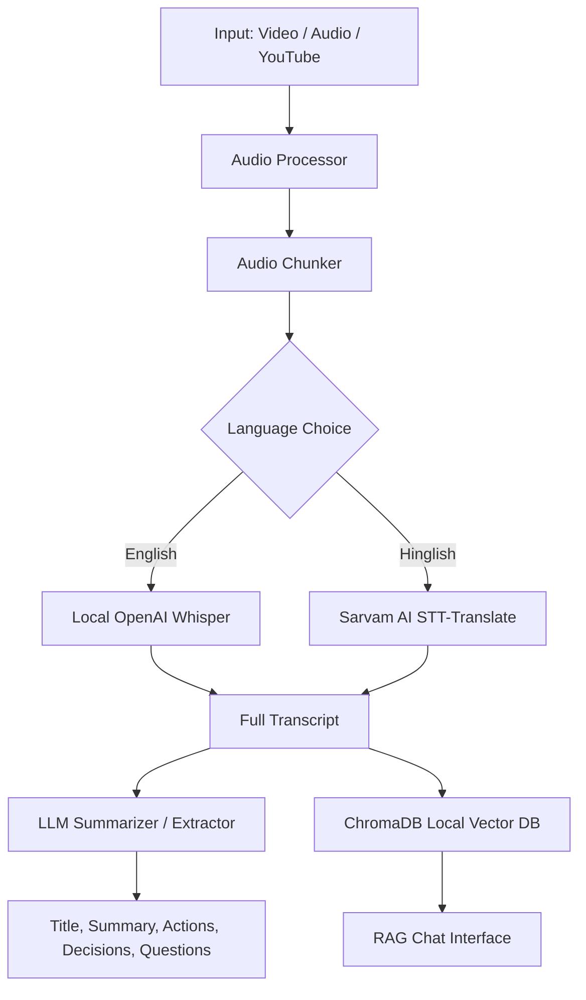

# 🎬 AI Video Assistant

An intelligent, premium meeting intelligence workspace to transcribe, summarize, and interact with your meeting recordings. Paste a YouTube URL, provide a local file path, or upload a video/audio file directly to extract key takeaways and chat with the transcript using local RAG (Retrieval-Augmented Generation).

---

## ⚡ Features

### 1. Multi-Format Input
*   **YouTube Integration**: Automatically fetches and processes audio from YouTube video links.
*   **Local Media Files**: Process local video (`.mp4`, `.mkv`, `.avi`, `.mov`) or audio (`.mp3`, `.wav`, `.m4a`) formats.
*   **Direct Upload**: Drag-and-drop file uploader in a premium glassmorphic interface.

### 2. Dual-Engine Transcription
*   **English Language**: Powered by a local **OpenAI Whisper** model. Runs entirely on your system.
*   **Hinglish (Hindi-English) Language**: Leverages **Sarvam AI's Speech-to-Text Translate API** to transcribe mixed Hinglish audio and translate it directly into English.

### 3. Smart Meeting Analysis
*   **Dynamic Title Generation**: Autogenerates descriptive titles for your meetings.
*   **Structured Summarization**: Generates clean, bulleted summaries of meeting topics.
*   **Action Item Extraction**: Identifies key tasks, assigning owners and deadlines automatically.
*   **Key Decisions**: Extracts important agreements and decisions made during the meeting.
*   **Open Questions**: Identifies unanswered questions or pending issues for future syncs.

### 4. Interactive Chat (RAG Engine)
*   Integrates **ChromaDB** as a local vector database and **HuggingFace Embeddings** to index the transcript.
*   Enables a contextual chat interface to query details, ask about timelines, or double-check decisions directly from the meeting transcript.

### 5. High-End UI/UX
*   **Glassmorphism**: Dark theme with translucent cards, borders, and neon violet/cyan gradients.
*   **Floating Glow Orbs**: Subtle background micro-animations that float dynamically.
*   **Live Status Tracker**: Sidebar indicators showing real-time progress for each pipeline step (Audio processing $\rightarrow$ Transcription $\rightarrow$ Summarization $\rightarrow$ RAG).

---

## 🛠️ Architecture



---

## 🚀 Getting Started

### Prerequisites
*   Python 3.10 or higher
*   **FFmpeg** installed on your system path (required for audio chunking and processing)

### Setup & Installation

1. **Clone the Repository**:
   ```bash
   git clone https://github.com/shreyashagrawal00/AI_Video_Assistant.git
   cd AI_Video_Assistant
   ```

2. **Create and Activate Virtual Environment**:
   ```bash
   python -m venv .venv
   # Windows PowerShell
   .venv\Scripts\Activate.ps1
   # macOS/Linux
   source .venv/bin/activate
   ```

3. **Install Dependencies**:
   ```bash
   pip install -r Requirements.txt
   ```

4. **Environment Variables**:
   Create a `.env` file in the root directory:
   ```env
   # API Keys for RAG and Orchestration
   MISTRAL_API_KEY=your_mistral_api_key
   SARVAM_API_KEY=your_sarvam_api_key

   # Optional Configuration
   WHISPER_MODEL=small
   SARVAM_STT_MODEL=saaras:v2.5
   ```

---

## 💻 Running the Application

### Option A: Streamlit UI (Recommended)
Run the premium interactive web application:
```bash
.venv\Scripts\streamlit run app.py
```
*Access the interface locally at `http://localhost:8501`*

### Option B: CLI Pipeline
Run the pipeline directly in the terminal:
```bash
python main.py
```

---

## 🌐 Deployment

This application is ready to deploy on **Streamlit Community Cloud**:
1. Push all code including [packages.txt](packages.txt) (contains `ffmpeg` system dependency) to your repository.
2. Sign in to [share.streamlit.io](https://share.streamlit.io/).
3. Connect your repository and click **Deploy**.
4. Paste the variables from `.env` in the **Advanced settings** $\rightarrow$ **Secrets** panel.
